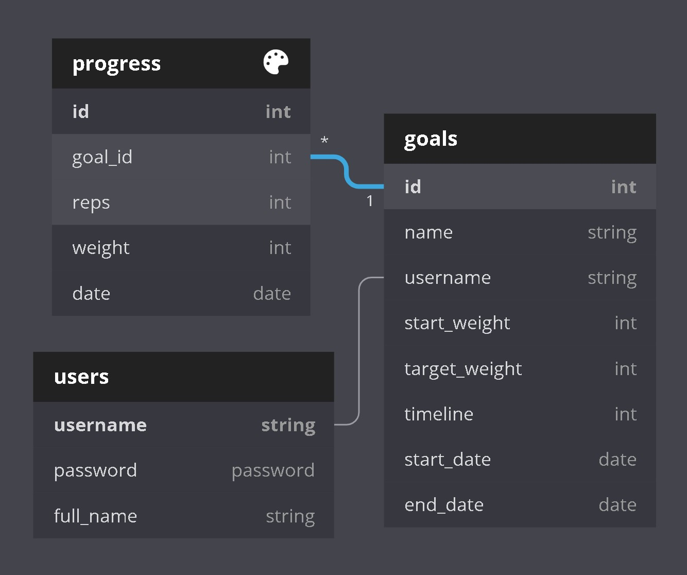

# GOALS backend

Backend database and API for Goals app.
Frontend found [here](https://github.com/cwaymeyer/goals-react-frontend).

JavaScript / Node / Express / PostgreSQL

##### To run

- `node server.js` (starts the server on port 3001)

### Functionality

<b>Goals is a workout progress tracker application.</b>

- Each "goal" is associated with an individual user.
- A goal will have a target weight to hit, and a desired timeline (3, 6, 9, or 12 months) to hit that weight.
- Recorded workouts are saved in the "progress" table.
- In all cases, dates are saved as [UNIX time](https://unixtime.org/).
   
  > <b>Goals table</b>
  - <i>username</i> is added on the front end.
  - <i>start_weight</i> is added on the front end based on the first inputed progress row.
  - <i>start_date</i> and <i>end_date</i> are automatically calculated through the JS Date object on the front end.
    > <b>Progress table</b>
  - <i>goal_id</i> and <i>orm</i> are not inputed, but are calculated on the front end.

### Database schema

